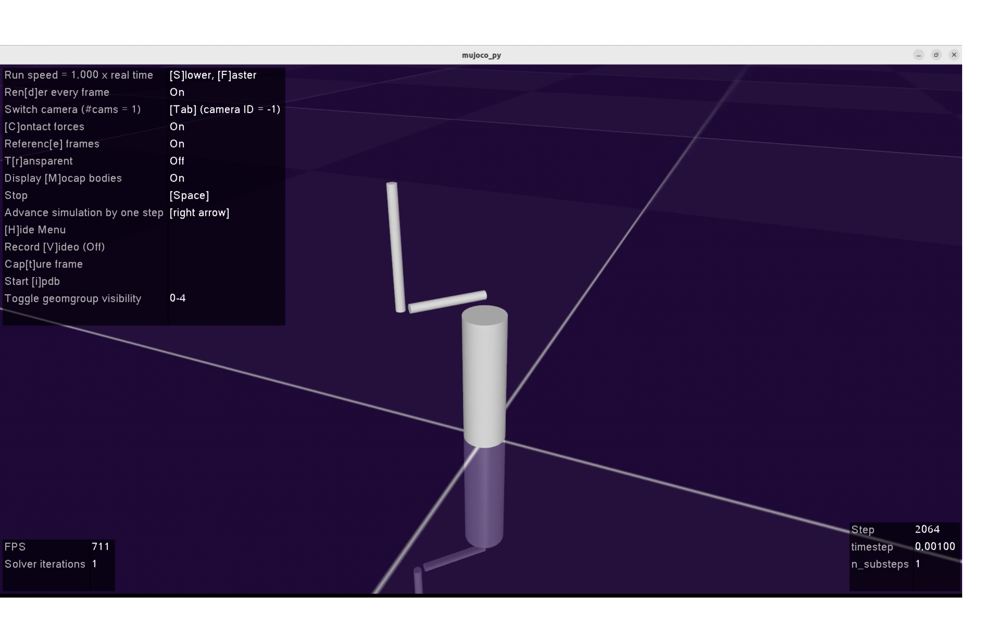

# Rotary Pendulum with PPO and Domain Randomization



## Overview
This repository is to control rotary pendulum (Furuta pendulum) using PPO and Domain Randomization.

### Author:
- **[Gyeongmin Kim](https://github.com/gmkim97), kgm04008@gmail.com**

## How to use?

### Notice
1. The modeling of rotary pendulum in XML format is from [macstepien](https://github.com/macstepien)'s furuta_pendulum repo. [[Link](https://github.com/macstepien/furuta_pendulum/blob/master/furuta_pendulum_rl/model/furuta_pendulum.xml)]
2. The codes are tested on the following setup.
    - Ubuntu 22.04
    - Python 3.8
    - CUDA 11.8
    - cudnn 8.7.0

### Environment
- Conda environment was used to set the environment of training rotary pendulum.  
- Details of the packages required are in environment.txt file.  
- The versions of the main packages are as follows.
    - pytorch == 2.3.0
    - stable-baselines3 == 1.8.0
    - gym == 0.21
    - mujoco-py == 2.1.2.14

### How to start?
1. Set the conda environment using environment.txt

2. Before running
```
### For mujoco_py

$ export LD_LIBRARY_PATH=$LD_LIBRARY_PATH:/home/gmkim/.mujoco/mujoco210/bin
$ export LD_LIBRARY_PATH=$LD_LIBRARY_PATH:/usr/lib/nvidia

### For renderer

$ export LD_PRELOAD=/usr/lib/x86_64-linux-gnu/libGL.so:/usr/lib/x86_64-linux-gnu/libGLEW.so
```

3. To check the rotary pendulum
```
$ cd rotary_pendulum
$ python rotaryenv_gym.py
```

4. To check the PPO training with domain randomization
```
$ cd rotary_pendulum
$ python rotaryenv_ppo.py
```

5. You can change the range of physical properties of rotary pendulum for domain randomization in **randomize_physical_properties** function in *rotaryenv.py*

5. The default mode of *rotaryenv_ppo.py* is 'eval'. If you want to train the pendulum yourself, you can change the value of train_mode **False** to **True** (Line 13).

6. Trained weights and tensorboards are given. Of course, you can use your own weights after training.


## Solving possible problems
- If you have a problem at installing gym==0.21, try
```
$ pip install setuptools==65.5.0
```
- If you 'still' have a problem, try
```
$ pip install wheel==0.38.4
```

## Reference
- **[Stable-baselines3 Documentation 1](https://stable-baselines3.readthedocs.io/en/master/misc/changelog.html#release-1-8-0-2023-04-07)**
- **[Stable-baselines3 Documentation 2](https://stable-baselines3.readthedocs.io/en/master/guide/tensorboard.html)**
- **[Openai gym issue 1](https://github.com/openai/gym/issues/3176)**
- **[Openai gym issue 2](https://github.com/openai/gym/issues/3211)**
- **[Tensorboard issue 1](https://github.com/tensorflow/tensorboard/issues/6808)**


